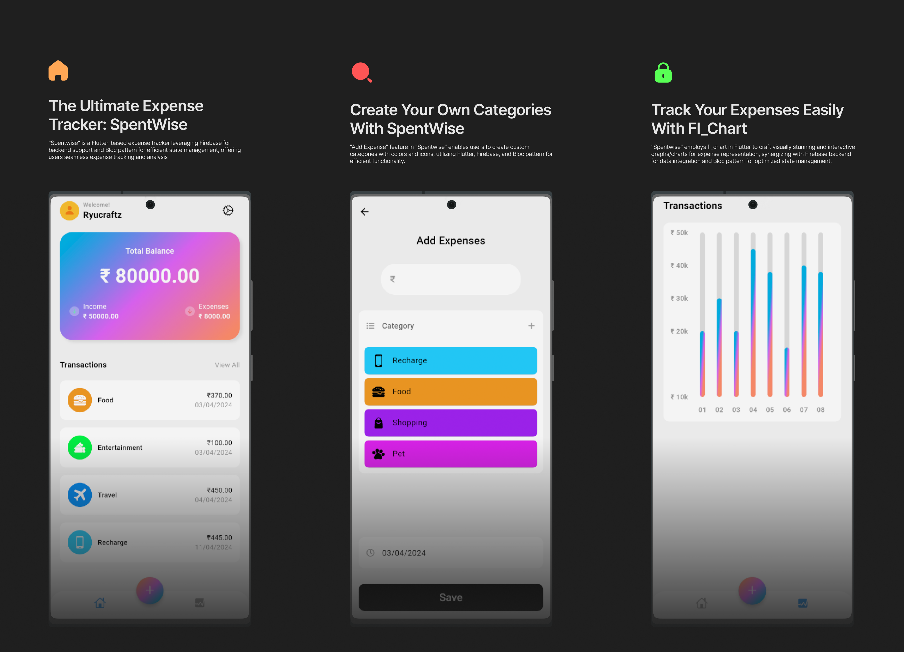

# SpentWise


## Stack

- [Flutter](https://flutter.dev/) - A UI toolkit for building natively compiled applications for mobile, web, and desktop from a single codebase.
- [Firebase](https://firebase.google.com/) - A platform developed by Google for creating mobile and web applications.
- [Bloc](https://bloclibrary.dev/) - A predictable state management library that helps implement the BLoC (Business Logic Component) design pattern.
- [fl_chart](https://pub.dev/packages/fl_chart) - A library for Flutter that provides beautiful and interactive charts for data visualization.
- Custom Icons - Utilized for enhancing the user interface and experience.


## Project structure

```
spentwise/
├── ios/
├── lib/
│   ├── blocs/
│   │   └── ...
│   ├── data/
│   │   ├── data.dart
│   │   └── ...
│   ├── screens/
│   │   └── ...
│   └── views/
│       └── ...
├── test/
├── web/
├── windows/
├── .dart_tool/
├── .packages
├── .pubspec.lock
├── .pubspec.yaml
└── ...

```

## License

MIT License.

---
